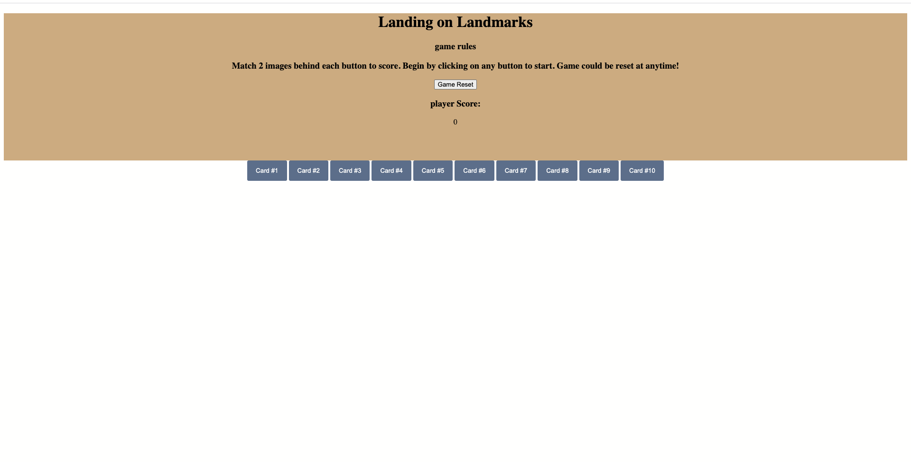

# Landing On Landmarks
------


------

## Technologies used:
HTML | CSS | Javascript | VS Code

------

## Installation instruction
No installation needed to play Landing on Landmark.  Please go to the website [here](https://oumsamon.github.io/Landing-on-LandMarks/) and follow the direction to play the game.

-----
## The Story:
The game app, Landing on Landmarks, will be a matching flash card game of known landmarks in USA. When an image matches each other, it will add points until all the cards are match.  This will be a work in progress program where I want to add more things as I learn new tools.

This is my first ever interactive webpage and I am happy of what I have so far.  

-----

## First concept/wireFrame


-----
## Hurdles

Game logic within Javascripts.  Learning how to take steps by steps with squadmate was probably one of the highlight of this project.  Feeling more confident with console.log and where/when to console.log is a breath of freshair.

```
       const selectedButtons = document.querySelectorAll('.selected');
        selectedButtons.forEach(btn => {
            btn.style.backgroundColor = "green"
            btn.disabled = true
        });
        
```
